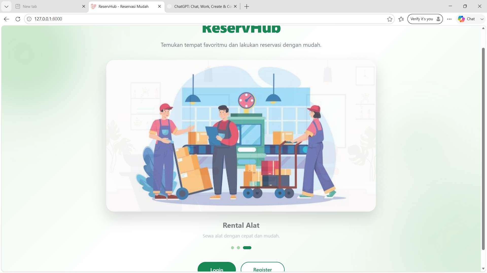
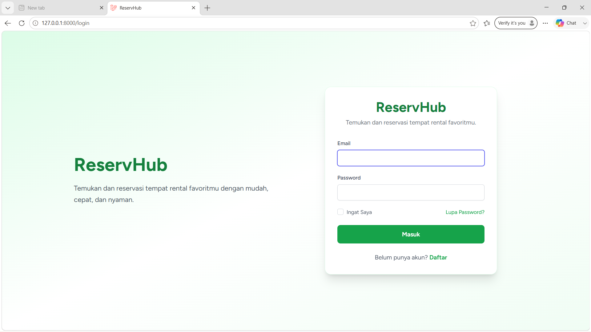
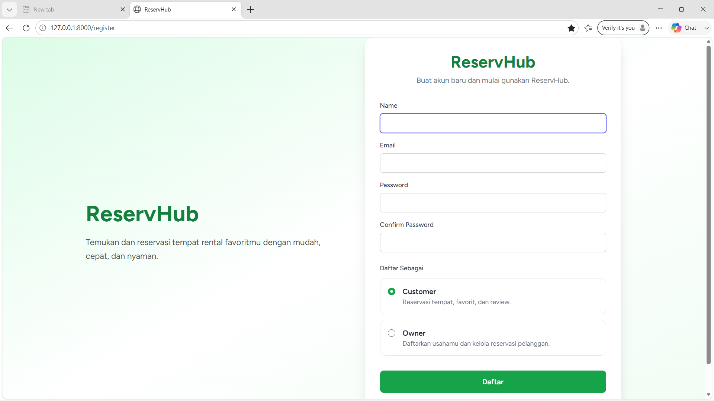
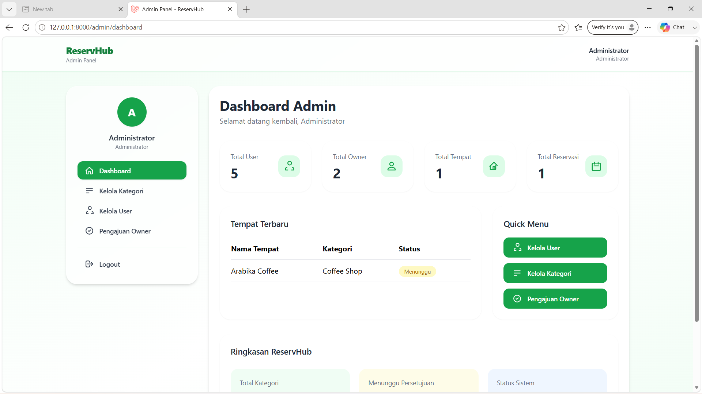
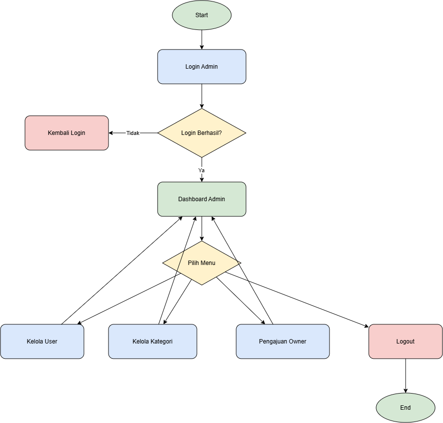
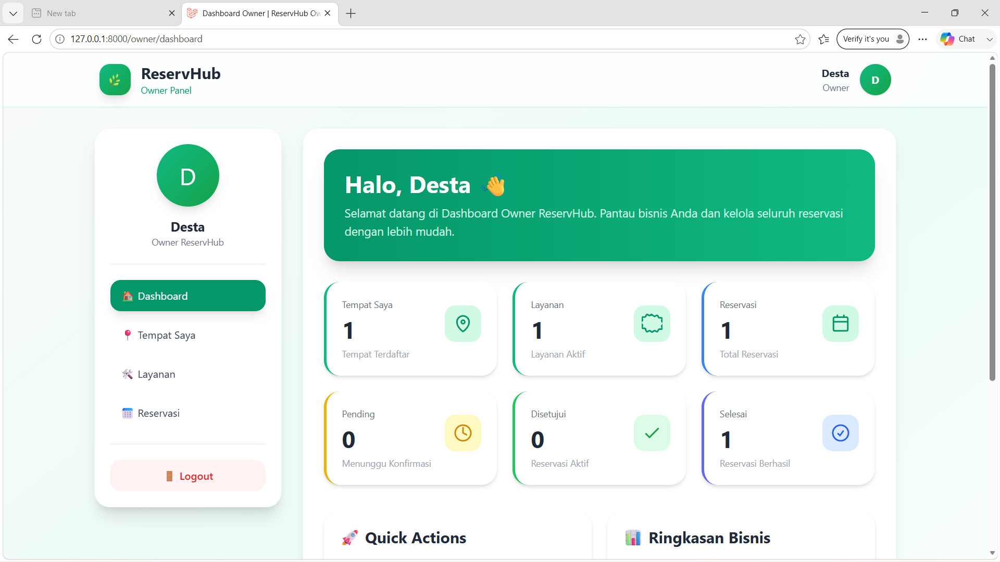
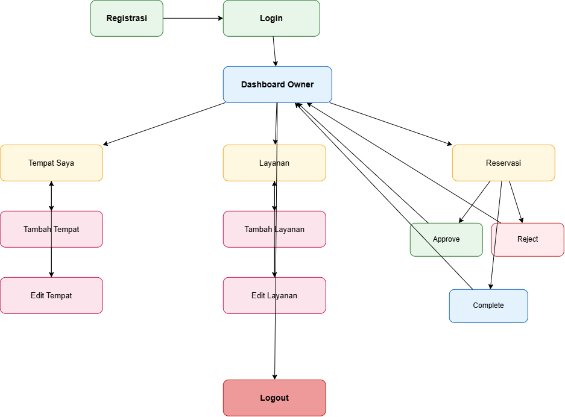
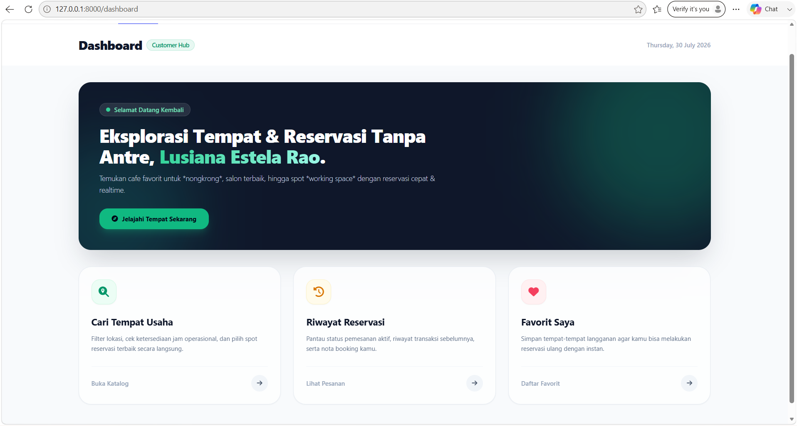
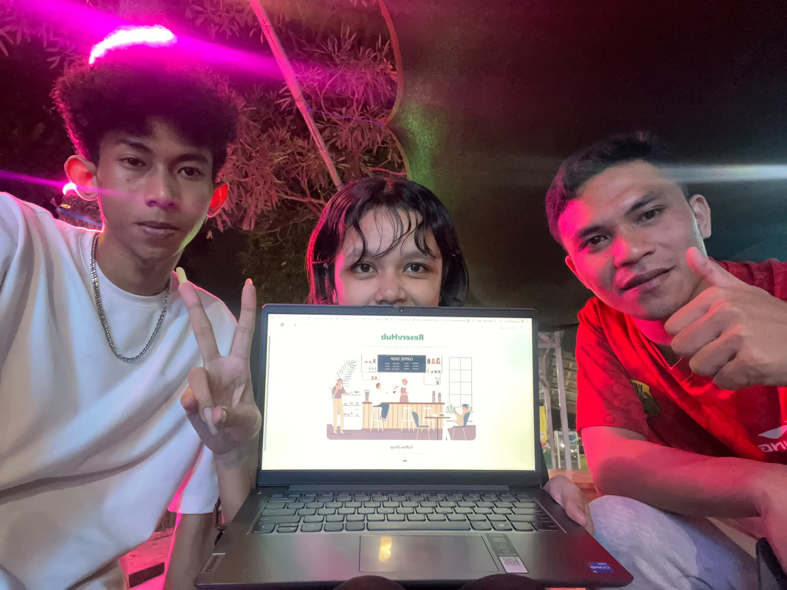

# ReservHub

ReservHub merupakan aplikasi reservasi tempat berbasis web yang dibangun menggunakan Laravel. Aplikasi ini memungkinkan pengguna melakukan reservasi pada berbagai jenis tempat seperti Coffee Shop, Salon, dan Rental Alat. Selain itu, ReservHub menyediakan fitur pengelolaan tempat oleh Owner serta proses verifikasi oleh Admin sehingga seluruh data yang ditampilkan kepada pelanggan telah melalui proses validasi.

---

# Anggota Kelompok

| Lusiana Estela Rao | 202359201037 | Admin & Back End |
| Aquinus Arfan Sego Fara | 202359201026 | Owner |
| Desta Andriyanto | 202359201007 | Customer |

---

# Teknologi yang Digunakan

- Laravel
- PHP 8
- SQLite
- Tailwind CSS
- Bootstrap
- JavaScript
- Vite

---

# Hak Akses (Role)

## Admin

Admin memiliki hak akses untuk:

- Login
- Dashboard Admin
- Kelola User
- Kelola Kategori
- Menyetujui Pengajuan Owner
- Menolak Pengajuan Owner
- Mengaktifkan / Menonaktifkan User

---

## Owner

Owner memiliki hak akses untuk:

- Registrasi
- Login
- Dashboard Owner
- Menambahkan Tempat
- Mengubah Data Tempat
- Menghapus Tempat
- Mengelola Layanan
- Melihat, Menerima / Menolak Reservasi

---

## Customer

Customer memiliki hak akses untuk:

- Registrasi
- Login
- Melihat Tempat
- Melakukan Reservasi
- Melihat Riwayat Reservasi
- Menyimpan Tempat Favorit
- Memberi Ulasan dan Penilaian
- Mengubah Profil

---

# Instalasi Aplikasi

Clone Repository

```bash
git clone https://github.com/Lusiana1607/ProjectUAS_PWII.git
```

Masuk ke folder project

```bash
cd ProjectUAS_PWII
```

Install dependency

```bash
composer install
```

Install Node Module

```bash
npm install
```

Copy file environment

```bash
cp .env.example .env
```

Generate Key

```bash
php artisan key:generate
```

Migrasi Database

```bash
php artisan migrate
```

Seeder Database

```bash
php artisan db:seed
```

Menjalankan Server

```bash
php artisan serve
```

Menjalankan Vite

```bash
npm run dev
```

---

# Akun Demo

## Admin

Email

admin@reservhub.com

Password

admin123

---

## Owner

Email

destaandrianto34@gmail.com

Password

desta123

---

## Customer

Email

lusianarao16@gmail.com

Password

Lusiana16

---

# Panduan Penggunaan

## Admin

- Login sebagai Admin
- Kelola User
- Kelola Kategori
- Verifikasi Pengajuan Owner
- Mengaktifkan atau Menonaktifkan User

---

## Owner

- Registrasi Sebagai Owner
- Menunggu Persetujuan Admin
- Login
- Menambahkan Tempat
- Mengelola Data Tempat
- Mengelola Layanan
- Melihat, Menerima / Menolak Reservasi

---

## Customer

- Registrasi
- Login
- Melihat Tempat
- Memilih Tempat
- Melakukan Reservasi
- Melihat Riwayat Reservasi
- Menyimpan Tempat Favorit
- Memberi Ulasan dan Penilaian

---

# Screenshot Aplikasi

## 1. Halaman Welcome



---

## 2. Login



---

## 3. Register



---

## 4. Dashboard Admin



---

## 5. User Flow Admin



---

## 6. Dashboard Owner



---

## 7. User Flow Owner



---

## 8. Dashboard Customer


---

## 9. User Flow Customer



---

## 10. Anggota Kelompok



---

# Video Demo

https://youtu.be/SWhWqNLOgHE?si=ZfHp0d3ncKbxztKC

---

# Repository

GitHub

https://github.com/Lusiana1607/ProjectUAS_PWII.git

---

# Lisensi

Project ini dibuat untuk memenuhi tugas Ujian Akhir Semester (UAS) Mata Kuliah Pemrograman Web II Program Studi Teknologi Informasi Universitas Utpadaka Swastika.
